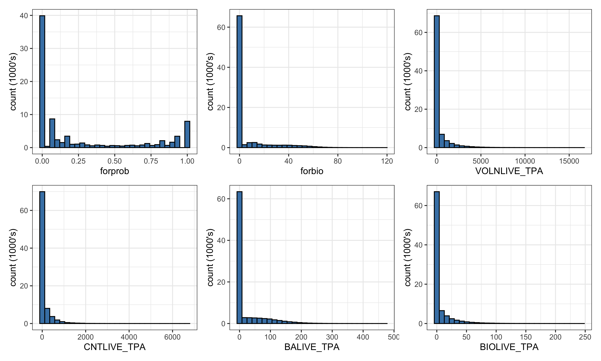

# Data

The data used in this thesis was collected by the Forest Inventory and
Analysis Program (FIA) in the span of 10 years from 2007 to 2017. While
this data was collected over this 10 year period, the analyses done
throughout this thesis are under the assumption that this is a
“snapshot” of the Interior West at some moment in time. Thus we do
not consider any temporal features of this dataset. The data we have is
plot-level data for the Interior West region of the United States, where
the data for each plot is collected by FIA and its crew members. The
units measured by the FIA and their ground crews are approximately 30 m
by 30 m hexagonal units. Since the Interior West covers over 140 million
acres of forestland, it is extremely impractical for FIA to measure
every unit (Source:
<https://www.fs.fed.us/rm/ogden/lib/interiorwest2.pdf>). Instead, they
sample from the population of 30 m by 30 m hexagonal units by using a
geographically-based systematic sampling design (Source: McConville et
al, 2020). The FIA chooses these samples by first overlaying a hexagonal
grid over the United States where each hexagon contains 6000 acres of
land. Then, they fill these hexagons with much smaller hexagons and
randomly sample from the population of small hexagons. Then, ground
crews go to these sampled small hexagons and collect variables such as
basal area, trees per acre, etc. This plot level data is what we are
working with throughout the duration of the thesis. In particular, the
dataset contains 86085 plots.

Again, the data we have is from the Interior West, and the FIA defines
the Interior West as Arizona, Colorado, Idaho, Montana, Nevada, New
Mexico, Utah, and Wyoming. For reference we have provided the Interior
West colored green on a map of the continental United
States:

While the data covers the Interior West as a whole, we have very
granular information, as each row represents a plot sampled by FIA. The
data also includes variables that subset the Interior West into
provinces which contain ecosections, and these ecosections contain
ecosubsections. In our data, on average, each ecosection contains
approximately 7.06 ecosubsections, and each province contains an average
of 4.86 ecosections. So, an average province then contains just over 34
ecosubsections. The data we have covers a total of 14 provinces, 68
ecosections, and 480 ecosubsections. The hierarchical struture of the
data and nestedness of the ecosubsections within ecosections within
provinces lends itself to be able to create hierarchical models which
borrow strength from surrounding areas.

While this data contains a multitude of variables, the analyses done in
this thesis focus on four key response variables and two explanatory
variables. The response variables used are basal area (square-foot),
trees per acre, above-ground biomass (lbs), and net volume (ft^3). These
variables are coded as `BALIVE_TPA`, `CNTLIVE_TPA`, `BIOLIVE_TPA`, and
`VOLNLIVE_TPA`, respectively. We can look at the average of these
variables across the Interior West region by ecosubsection in the plots
below.

While we have four variables which we will model as response variables
throughout the analyses, we also have two predictor variables which will
be of much use to us. In particular, forest probability and forest
biomass (coded as `forprob` and `forbio`.) These variables which we will
treat as predictors are remotely sensed variables, meaning that they
were not collected by FIA crew members, but rather with aerial
photography and/or satellite imagery. However, we will be using these
variables to attempt to predict our response variables in order to
understand how good of estimates we can make with this remote data that
does not require as much effort to collect. While it may seem unnatural
to attempt to predict forest biomass with forest biomass, the
differences in the data collection process between the ground level data
and remotely sensed data are quite different.

These variables are almost all right-skewed, and all take value zero
quite often. This is because there is lots of land in the Interior West
which is not forest, hence our forestry variables should take the value
zero. To see these phenomena, we can look at histograms of our six key
variables:

It is notable that the `forprob` variable is bimodal and modes zero and
one, while all other variables are extremely right-skewed. We can also
summarize the data to see some summary statistics of our six key
variables: <!--html_preserve-->

<table class="gt_table">

<thead class="gt_col_headings">

<tr>

<th class="gt_col_heading gt_columns_bottom_border gt_left" rowspan="1" colspan="1">

variable

</th>

<th class="gt_col_heading gt_columns_bottom_border gt_right" rowspan="1" colspan="1">

mean

</th>

<th class="gt_col_heading gt_columns_bottom_border gt_right" rowspan="1" colspan="1">

quantile\_25

</th>

<th class="gt_col_heading gt_columns_bottom_border gt_right" rowspan="1" colspan="1">

median

</th>

<th class="gt_col_heading gt_columns_bottom_border gt_right" rowspan="1" colspan="1">

quantile\_75

</th>

<th class="gt_col_heading gt_columns_bottom_border gt_right" rowspan="1" colspan="1">

min

</th>

<th class="gt_col_heading gt_columns_bottom_border gt_right" rowspan="1" colspan="1">

max

</th>

<th class="gt_col_heading gt_columns_bottom_border gt_right" rowspan="1" colspan="1">

na\_count

</th>

</tr>

</thead>

<tbody class="gt_table_body">

<tr>

<td class="gt_row gt_left">

forbio

</td>

<td class="gt_row gt_right">

6.66

</td>

<td class="gt_row gt_right">

0

</td>

<td class="gt_row gt_right">

0.00

</td>

<td class="gt_row gt_right">

0.00

</td>

<td class="gt_row gt_right">

0

</td>

<td class="gt_row gt_right">

118.00

</td>

<td class="gt_row gt_right">

0

</td>

</tr>

<tr>

<td class="gt_row gt_left">

forprob

</td>

<td class="gt_row gt_right">

0.27

</td>

<td class="gt_row gt_right">

0

</td>

<td class="gt_row gt_right">

0.07

</td>

<td class="gt_row gt_right">

0.56

</td>

<td class="gt_row gt_right">

0

</td>

<td class="gt_row gt_right">

1.00

</td>

<td class="gt_row gt_right">

1

</td>

</tr>

<tr>

<td class="gt_row gt_left">

BIOLIVE\_TPA

</td>

<td class="gt_row gt_right">

6.23

</td>

<td class="gt_row gt_right">

0

</td>

<td class="gt_row gt_right">

0.00

</td>

<td class="gt_row gt_right">

1.98

</td>

<td class="gt_row gt_right">

0

</td>

<td class="gt_row gt_right">

244.35

</td>

<td class="gt_row gt_right">

0

</td>

</tr>

<tr>

<td class="gt_row gt_left">

BALIVE\_TPA

</td>

<td class="gt_row gt_right">

22.75

</td>

<td class="gt_row gt_right">

0

</td>

<td class="gt_row gt_right">

0.00

</td>

<td class="gt_row gt_right">

14.75

</td>

<td class="gt_row gt_right">

0

</td>

<td class="gt_row gt_right">

469.39

</td>

<td class="gt_row gt_right">

0

</td>

</tr>

<tr>

<td class="gt_row gt_left">

CNTLIVE\_TPA

</td>

<td class="gt_row gt_right">

98.60

</td>

<td class="gt_row gt_right">

0

</td>

<td class="gt_row gt_right">

0.00

</td>

<td class="gt_row gt_right">

30.09

</td>

<td class="gt_row gt_right">

0

</td>

<td class="gt_row gt_right">

6677.93

</td>

<td class="gt_row gt_right">

0

</td>

</tr>

<tr>

<td class="gt_row gt_left">

VOLNLIVE\_TPA

</td>

<td class="gt_row gt_right">

342.32

</td>

<td class="gt_row gt_right">

0

</td>

<td class="gt_row gt_right">

0.00

</td>

<td class="gt_row gt_right">

74.69

</td>

<td class="gt_row gt_right">

0

</td>

<td class="gt_row gt_right">

16435.55

</td>

<td class="gt_row gt_right">

0

</td>

</tr>

</tbody>

</table>

<!--/html_preserve-->
