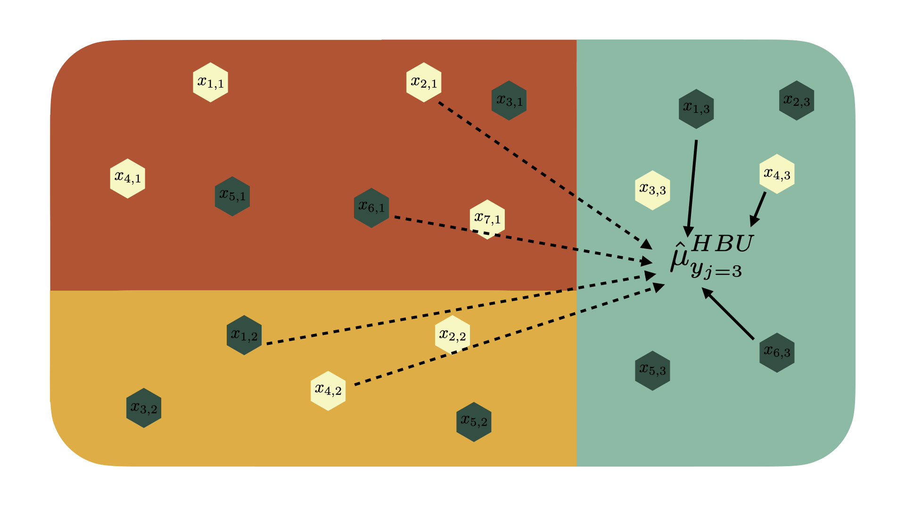

# Context {#context}

National forest inventories such as the United States Forest Inventory and Analysis Program (FIA) monitor the status of a nation's forests by collecting data and estimating forest attributes such as basal area, above-ground biomass, tree count per acre, and net volume. The FIA cannot collect the population data for these variables across the United States, so the FIA uses a sampling design intended for estimation over large geographic regions such as states. This sampling design works very well for estimation in large regions and maintains a reasonable cost of employing foresters. While this method works sufficiently for large areas, it has become an interest of national forest inventories such as the FIA to be able to provide reliable and efficient estimates of forest attributes in small domains such as ecological subsections (often referred to as eco-subsections) or counties. In particular, the FIA would like to have estimates with low variance in eco-subsections, however, the FIA only samples a small numbers of plots in these small areas. Currently, the FIA's standard approach to this problem is by using post-stratification. Post-stratification uses a weighted average of the forest attribute of interest and corrects for over- or under-sampling of forested land in the small area. While this estimator is unbiased, it introduces high variance and a lack of precision necessary for estimation at the eco-subsection level. The research goal of this thesis is to address this problem by using techniques which seek to minimize estimate variance while only introducing a small amount of bias. Having precise estimates of forest attributes at the eco-subsection level is crucial for educational programs and implementation of programs which seek to maintain the health of our forests.

In order to produce these estimates we must perform small area estimation. But what is small area estimation? Small area estimation is a branch of survey statistics which includes techniques that allow us to estimate the value of parameters at a sub-population level. Typically in survey estimation, we are interested in doing inference at a population level, however we are sometimes interested in attaining estimates for sub-populations or "small areas." We can visualize the process by considering an ecological province divided into three eco-subsections, each of which have sampled areas:
```{r ecological-province-diagram, fig.align="center", out.width='100%', echo = FALSE, fig.cap="An Ecological Province"}
knitr::include_graphics("figure/ecoprov-diagram.png")
```
As stated before, we are interested in performing inference at the sub-population level. Therefore we are interested in learning about the value of forest attributes in the blue, orange, and green areas of Figure \@ref(fig:ecological-province-diagram). There are wide range of techniques that can be used to carry out this small area estimation. Broadly, these methods fall into three categories: direct estimators, indirect estimators, and model-based estimators. Each of these methods attempts to do inference at the sub-population level, however, they are quite different from each other. 

Direct estimators are defined as those that rely only on the samples within the small area which we would like to measure. Some examples of a direct estimator are the mean of a variable, or the post-stratified estimate of a variable. The post-stratified estimate is similar to the mean, however it accounts for under- and over-sampling of forested areas in a given sub-population. These estimates do not rely on information outside of the small area being estimated, however, the post-stratified estimator uses auxiliary information such as the true proportion of forested land within the small area to produce estimates. Direct estimation is the simplest kind of small area estimator as it only relies on samples within the sub-population of interest to produce its estimates. We can visualize these two estimators to get a better sense of their estimation process by considering how they would estimate some $y$ variable in our green sub-population $j$ from Figure \@ref(fig:ecological-province-diagram). 
```{r mean-diagram, fig.align="center", out.width='100%', echo = FALSE, fig.cap="The mean as a direct estimator"}
knitr::include_graphics("figure/mean-diagram.png")
```
```{r ps-diagram, fig.align="center", out.width='100%', echo = FALSE, fig.cap="The post-stratified direct estimator"}

```
The second kind of estimator, indirect estimators, rely on data outside of the area of interest to produce their estimate, however they do not rely on auxiliary data. With indirect estimators, we can use information (or "borrow strength") from nearby small areas to help improve our estimate in our area of interest through implicit use of a model. These indirect estimators are quite a bit more complicated than direct estimators due to the fact that they borrow strength, however, they often significantly reduce variance in estimates due to the added information from other sub-populations. Finally, explicit model-based estimators are those which both borrow strength from other small areas, use auxiliary information, and explicitly use a model to compute the estimate of interest. These estimators are still within the family of indirect estimators, but make explicit use of a model. Similarly to the indirect estimators discussed previously, these models can further reduce the variance of our estimates because they allow for more information to be used in the estimate. We can further categorize these explicit model-based estimators into two classes, unit-level and area-level models. Unit-level models consider information at the level of which the data was collected. Area-level models consider information that has been aggregated to the level of a small area before the model is fit to the data. This thesis is primarily investigates to usefulness of the hierarchical Bayesian unit-level model (HBU) and hierarchical Bayesian area-level model (HBA). We can visualize these estimators to give a better sense of the differences between the two. 
```{r hbu-diagram, fig.align="center", out.width='100%', echo = FALSE, fig.cap="The unit-level hierarchical Bayesian model"}

```
```{r hba-diagram, fig.align="center", out.width='100%', echo = FALSE, fig.cap="The area-level hierarchical Bayesian model"}
knitr::include_graphics("figure/hba-diagram.png")
```
We can see that both the hierarchical Bayesian unit- and area-level models borrow strength from surrounding areas and explicitly model the $y$ variable outcome as a function of remotely sensed $x$ variable(s). The notable difference between the two models is that the hierarchical Bayesian unit-level models borrows strength from the unit-level data while the area-level model borrows strength from data aggregated by the post-stratified direct estimator. Notably, Figures \@ref(fig:hbu-diagram) and \@ref(fig:hba-diagram) would be the same for the frequentist empirical best linear unbiased prediction (EBLUP) unit- and area- level models as these diagrams do not depict the details of how strength is borrowed across eco-subsections. These EBLUP models borrow strength in a way that minimizes bias given modeling assumptions are correct whereas the hierarchical Bayesian models do not.

Explicit model-based estimation has been increasing in popularity in the realm of applications to the FIA and forestry data in general. As the FIA requires a reduction in variance for their estimates of increasingly smaller areas, it becomes inevitable that borrowing strength from surrounding areas, the use of auxiliary data, and the explicit use of a model is needed to maintain a satisfactory amount of variance. Commonly, frequentist model-based estimators are used for model-based small area estimation, such as the EBLUP estimator. Models such as the EBLUP have some very nice properties, most notably, they are "unbiased" if the assumed model is correct. This means that, given the modeling assumptions are met, our estimate ($\bar y_j$) of our parameter ($\mu_{y_j}$) for each sub-population will have the following property:
\begin{align}
E[\bar y_j] - \mu_{y_j} = 0.
\end{align}
That is, the expected value of the statistic, $\bar y_j$, is in fact the true value of the forest attribute of interest. It is clear as to why this is a trait we would want in our model and to why it is so commonly used, however, what is not clear is the cost of this trait. By only focusing on reducing the bias in our estimates, we must ignore the second piece of the mean squared error, the variance. While it is important for bias to be low, we can often reduce our mean squared error by a large amount by increasing bias slightly, as bias and variance are inversely related. We can see by the representation of the mean squared error (MSE) as the sum of the variance and squared bias of our estimator: 
\begin{align}
\text{MSE}(\bar y_j) = \text{Var}(\bar y_j) + \text{Bias}(\bar y_j,~ \mu_{y_j})^2
\end{align}
This thesis explores this trade-off between bias and variance in depth. We implement hierarchical Bayesian unit- and area-level models which allow for the estimates to be slightly biased while reducing variance. Throughout this thesis, we compare these techniques to small area estimations methods such as the EBLUP and the post-stratified direct estimator. By applying these models on four response variables across the entire Interior West at the eco-subsection level, we can add a great deal of understanding to the usefulness of hierarchical Bayesian models in a small area estimation context, especially when considering its usefulness to the FIA and other forestry organizations. We only have been able to source one paper which uses hierarchical Bayesian modeling for small area estimation with a forestry application, and they only consider the area-level model with a particular response variable in particular forest [@ver2017]. This thesis thus adds significantly to our understanding of the usefulness of hierarchical Bayesian small area estimation in a forestry setting due to the introduction of the unit-level model, the vast number of response variables studied, and the vast range of area where we test the usefulness of this model. 

<!-- *provides background material on the topic and other approaches, and identifies what is added by this thesis* -->
<!-- To implement these models, there are two statistical schools of thought: frequentist methods and Bayesian methods. Frequentist models are the most common for estimation of forest attributes in small area estimation [CITE LOTS OF PAPERS HERE]. However, Bayesian methods have been used at the area-level for small area estunation of of forest attributes [@ver2017]. While frequentist methods are often viewed as the "default" method for doing small area estimation, there are many benefits of tackling these problems from a Bayesian perspective. Notably, Bayesian estimation utilizes prior distributions which allow us to quantify our prior uncertainty about the values of each parameter.  -->