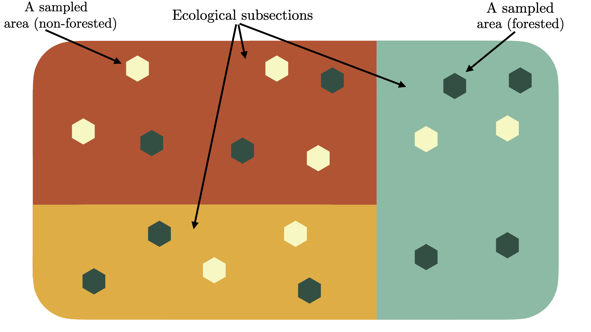
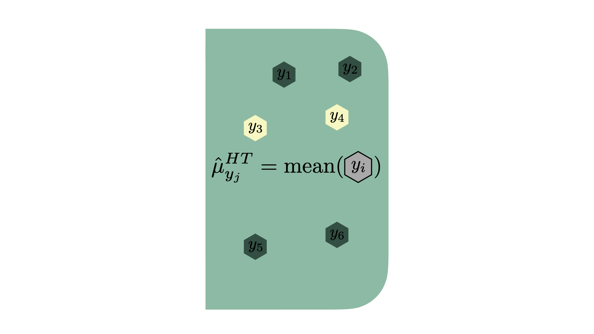
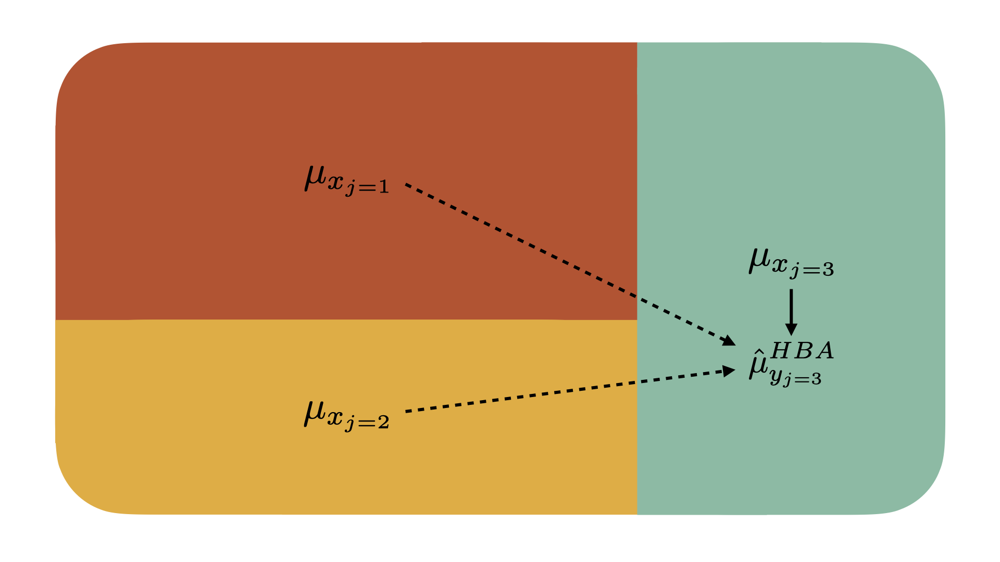

# Context {#context}

## Introduction

National forest inventories such as the United States Forest Inventory and Analysis Program (FIA) monitor the status of a nation's forests by collecting data and estimating forest attributes such as basal area, above-ground biomass, tree count per acre, and net volume. Due to the sheer amount of forests in the United States, the FIA cannot collect census data on the nation's forests. Instead, they use a sampling design intended and well-suited for estimation of these key variables over large geographic regions. This sampling design works very well for estimation of forest attributes in large regions and maintains a reasonable cost of employing foresters to collect the samples. While this method works sufficiently for large areas, national forest inventories such as the FIA have developed an interest in being able to provide reliable and efficient estimates of forest attributes in small domains such as ecological subsections (often referred to as eco-subsections) and counties. In particular, the FIA would like to have estimates for the mean of these response variables with low variance in eco-subsections; however, the FIA only samples a limited number of plots in each of these eco-subsections. Currently, the FIA's standard approach to estimation is to use post-stratification. Post-stratification employs a weighted average of the forest attribute of interest and corrects for over- or under-sampling of forested land in a given small area. While this estimator is unbiased and has lower variance than the sample mean, it does not reduce the variance enough for precise estimation at the eco-subsection level. The research goal of this thesis is to address this problem by using techniques which seek to minimize estimate variance while introducing only a small amount of bias. 

Having low variance estimates of forest attributes at the eco-subsection level is crucial for educational programs, the implementation of programs which seek to maintain the health of our forests, and a number of other reasons: "FIA is responsible for reporting on dozens, if not hundreds, of forest attributes relating to merchantable timber and other wood products, fuels and potential fire hazard, condition of wildlife habitats, risk associated with fire, insects or disease, biomass, carbon storage, forest health, and other general characteristics of forest ecosystems." [@mcconville2020]. The ability to provide relevant information to land owners related to the listed forest attributes is reliant on the ability to attain low variance estimates of forest attributes on that land. Estimates with high variance oftentimes do not allow for enough knowledge to be gained about the forest attributes of interest. Maintenance of these forested areas is crucial for preventing wildfires within small areas and for the surrounding area. Thus, it is important to inform private land owners of steps that must be taken to maintain the safety of their forested land and the surrounding land. Not only do wildfires cause damage to the trees they burn, but they also cause countless animals to lose their homes every year. These concerns, along with other risks related to the forest attributes listed above, are the motivation to continue to strive for low variance estimates of forest attributes. 

This thesis is a study of how to further reduce variance of forest attribute estimates through the mechanism of hierarchical Bayesian estimators. In order to introduce, study, and implement these estimators I approach the research through the following organization of ideas:

* The remainder of Chapter \@ref(context) discusses current common approaches for estimation of forest attributions. I also introduce less common approaches to performing this estimation, such as the hierarchical Bayesian approach. I introduce the idea of borrowing strength and discuss how different estimators borrow strength.
* Chapter \@ref(data) introduces the data used to accomplish the research goal. I discuss the nested structure of the data and how these data are appropiate for hierarchical modeling. I explore the spatial aspects of our response variables and the distributions of these variables. I also introduce the data used for the explanatory variable and the data used for strata weighting.
* Chapter \@ref(methods) builds up the theory and mathematics behind the estimators used in this thesis. Starting at the simplest case of the sample mean, I progressively introduce new estimators which take varying levels of information into account. I also introduce some theory regarding Bayesian statistics in order to build intuition for our hierarchical Bayesian estimators.
* Chapter \@ref(results) showcases the results of each estimator's performance. I discuss strengths and weaknesses of estimators implemented. These results are explored spatially, and insight is gained into regions where particular estimators reduce variance more than others.
* Chapter \@ref(discussion) discusses the key findings of this thesis, the limitations regarding these findings, and possible extensions of the work done in this thesis.

## Methodological Overview

In order to produce estimates for the mean of forest attributes at some sub-population level, we must perform small area estimation. Small area estimation is a branch of survey statistics which includes techniques that allow us to estimate the value of parameters at a sub-population level. Typically in survey estimation, we are interested in making inferences at a population level; however, we are sometimes interested in attaining estimates for sub-populations. In the case of this thesis, the sub-populations are the eco-subsections and the populations are the eco-provinces. We can visualize the process of attaining estimates for eco-subsections by considering an eco-province divided into three eco-subsections, each of which has sampled areas as displayed in Figure \@ref(fig:ecological-province-diagram).
```{r ecological-province-diagram, fig.align="center", out.width='100%', echo = FALSE, fig.scap="An ecological province", fig.cap="An ecological province containing three eco-subsections. The red, yellow, and seafoam areas represent eco-subsections. The green hexagons represent forested areas sampled by the FIA. The beige hexagons represent non-forested areas sampled by the FIA."}

```
We are interested in making inferences at the sub-population level, and in Figure \@ref(fig:ecological-province-diagram) these sub-populations are represented by the red, yellow, and seafoam areas. Importantly, estimates of forest attributes in each of these sub-populations are required. There are wide range of techniques that can be used to carry out this small area estimation. Broadly, these methods fall into three categories: direct estimators, indirect estimators with implicit models, and indirect estimators with explicit models. I will often refer to indirect models with explicit models as "model-based estimators." Each of these methods attempts to make inferences at the sub-population level, however, they are quite different from each other. 

Direct estimators are defined as those that rely only on the samples within the small area which we would like to measure. Some examples of a direct estimator are the sample mean or the post-stratified estimator. The post-stratified estimator is similar to the sample mean; however, it accounts for under- and over-sampling of forested areas in a given sub-population. These estimators do not rely on information outside of the small area being estimated; however, the post-stratified estimator uses auxiliary information such as the true proportion of forested land within the small area to produce estimates. Direct estimation is the simplest kind of small area estimator, as it only relies on samples within the sub-population of interest to produce its estimates. Figures \@ref(fig:mean-diagram) and \@ref(fig:ps-diagram) visualize these two estimators which allows for one to get a better sense of their estimation process by considering how they would estimate some forest attribute $y$ in the seafoam sub-population $j$ from Figure \@ref(fig:ecological-province-diagram). 
```{r mean-diagram, fig.align="center", out.width='100%', echo = FALSE, fig.scap="The sample mean as a direct estimator", fig.cap = "The sample mean as a direct estimator in the seafoam eco-subsection. This estimator only relies on sampled areas (hexagons) within the eco-subsection. This estimator does not take into account whether the sampled areas are forested (green) or non-forested (beige) areas. This estimator does not use a model to produce estimates and hence uses the \\textit{y} variable collected by FIA foresters to produce the needed estimate, as shown inside the hexagons."}

```
\clearpage
```{r ps-diagram, fig.align="center", out.width='100%', echo = FALSE, fig.scap="The post-stratified direct estimator", fig.cap = "The post-stratified direct estimator in the seafoam eco-subsection. This estimator only relies on sampled areas (hexagons) within the eco-subsection. This estimator takes into account whether the sampled areas are forested (green) or non-forested (beige) areas. It then weights our estimate based on the true population's proportion of forested area in the eco-subsection. This estimator does not use a model to produce estimates and hence uses the \\textit{y} variable collected by FIA foresters to produce the needed estimate, as shown inside the hexagons."}
knitr::include_graphics("figure/ps-diagram.png")
```
Figure \@ref(fig:mean-diagram) illustrates the sample mean, which only relies on sampled areas within the eco-subsection and does not take into account whether the sampled areas are forested or non-forested. Figure \@ref(fig:ps-diagram) illustrates an extension of the sample mean: the post-stratified estimator. This estimator is a weighted average of two sample means which takes into account whether the sampled areas are forested or non-forested by using auxiliary data in the eco-subsection of interest.

The second kind of estimator--indirect estimators with implicit models--relies on data outside of the area of interest to produce its estimate and can rely on auxiliary data but implements a model implicitly. With implicit, model-based, indirect estimators, information can be used from nearby small areas to help improve improve the estimate (i.e. reduce variance) in the area of interest through implicit use of a model. These indirect estimators are quite a bit more complicated than direct estimators due to the fact that they borrow strength from the variable of interest across small areas; however, they often significantly reduce variance in estimates due to the added information from other sub-populations. According to Rao (2014), while indirect estimators with implicit models reduce variance, they are often design biased due to their inability to specify between-area variation. This is a large cost of implementing implicit, model-based, indirect estimators. Further, these estimators do not reduce variance as significantly as explicit model-based estimators. Thus, I will not implement indirect estimators with implicit models in this thesis. 

Finally, explicit model-based estimators are those which borrow strength from other small areas, use auxiliary information, and explicitly use a model to compute the estimate of interest. These estimators are still within the family of indirect estimators. However, they make explicit use of a model. Similarly to the indirect estimators with implicit models discussed previously, these models can further reduce the variance of the estimates because they allow for more information to be used when producing the estimate. The explicit model-based estimators can be further categorized into two classes: unit-level and area-level models. Unit-level models consider information at the level at which the data were collected. Area-level models consider information that has been aggregated to the level of a small area before the model is fit to the data. Commonly, the empirical best linear unbiased prediction model (EBLUP) is used in small area estimation as the model-based estimator of choice. This is because both the area- and unit-level EBLUP models reduce variance further than direct and indirect estimators with implicit models, and they are design unbiased given the modeling assumptions are met. This thesis primarily investigates the usefulness of the hierarchical Bayesian unit-level model (HBU) and hierarchical Bayesian area-level model (HBA). Below, in Figures \@ref(fig:hbu-diagram) and \@ref(fig:hba-diagram), the HBU and HBA estimators are visualized to give a better sense of the differences between the two.
```{r hbu-diagram, fig.align="center", out.width='100%', echo = FALSE, fig.scap="The unit-level hierarchical Bayesian model", fig.cap = "The unit-level hierarchical Bayesian model producing an estimate in the seafoam eco-subsection. This estimator relies on auxiliary information from all eco-subsections within a given eco-province to produce estimates as shown by the arrows. Notably, more information is used in the eco-subsection of interest to produce the estimate, denoted by the solid arrows. The dashed arrows illustrate that less information is being used from outside eco-subsections. This estimator also produces estimates based on remotely-sensed data, as denoted by the \\textit{x} variables in each hexagon. This estimator uses information at the unit level, meaning that it produces estimates from the plot level of granularity."}
knitr::include_graphics("figure/hbu-diagram.png")
```
\clearpage
```{r hba-diagram, fig.align="center", out.width='100%', echo = FALSE, fig.scap="The area-level hierarchical Bayesian model", fig.cap = "The area-level hierarchical Bayesian model producing an estimate in the seafoam eco-subsection. This estimator relies on auxiliary information from all eco-subsections within a given eco-province to produce estimates as shown by the arrows. Notably, more information is used in the eco-subsection of interest to produce the estimate, denoted by the solid arrows. The dashed arrows illustrate that less information is being used from outside eco-subsections. This estimator also produces estimates based on remotely-sensed data, as denoted by the \\textit{x} variables in each hexagon. This estimator uses information at the area level, meaning that it produces estimates based on the post-stratified estimate in each eco-subsection."}

```
Figures \@ref(fig:hbu-diagram) and \@ref(fig:hba-diagram) illustrate that the hierarchical Bayesian unit- and area-level models borrow strength from surrounding areas and explicitly model the $y$ variable outcome as a function of remotely-sensed $x$ variable(s). The notable difference between the two models is that the hierarchical Bayesian unit-level model borrows strength from the unit-level data, while the area-level model borrows strength from data aggregated by the post-stratified direct estimator.

It is important to note that while Figures \@ref(fig:hbu-diagram) and \@ref(fig:hba-diagram) describe the hierarchical Bayesian estimators, the diagrams would be the same for the unit- and area-level EBLUP estimators. This is due to the fact that the EBLUP estimators just assume a frequentist mixed model rather than a Bayesian one. These estimators are of course different. I just do not explicitly show how the magnitude of strength borrowed is decided in Figures \@ref(fig:hbu-diagram) and \@ref(fig:hba-diagram). 

Explicit model-based estimation has been increasing in popularity in the realm of applications to the FIA and forestry data in general. As the FIA requires a reduction in variance for their estimates of increasingly smaller areas, it becomes inevitable that borrowing strength from surrounding areas, the use of auxiliary data, and the explicit use of a model are needed to maintain a satisfactory amount of variance. Commonly, frequentist model-based estimators are used for model-based small area estimation, such as the EBLUP estimator. Models such as the EBLUP have some very nice properties. Most notably, they are "unbiased" if the assumed model is correct. To understand what it means to have an "unbiased" estimator, we must first define bias of some estimator $\hat\mu_{y_j}$ of a parameter $\mu_{y_j}$: 
\begin{align}
\text{Bias}(\hat\mu_{y_j}) = E[\hat\mu_{y_j}] - \mu_{y_j} (\#eq:bias)
\end{align}
It intuitively follows that if the modeling assumptions are met and our estimator $\hat\mu_{y_j}$ is unbiased that we will have the following property:
\begin{align}
\text{Bias}(\hat\mu_{y_j}) = E[\hat\mu_{y_j}] - \mu_{y_j} = 0
\end{align}
That is, the expected value of the estimator, $\hat\mu_{y_j}$, is in fact the true value of the forest attribute of interest. It is clear why this is a trait we would want in our model and why it is so commonly used; however, what is not clear is the cost of this trait. By only focusing on reducing the bias in our estimates, we must ignore the second piece of the mean squared error: the variance. The variance of an estimator can be defined as follows:
\begin{align}
\text{Var}(\hat\mu_{y_j}) = E\Big[\Big(\hat\mu_{y_j} - E[\hat\mu_{y_j}]\Big)^2 \Big] (\#eq:variance)
\end{align}
While it is important for bias to be low, we can often reduce our mean squared error by a large amount by increasing bias slightly, as bias and variance are inversely related. From Equations \@ref(eq:bias) and \@ref(eq:variance) it may not be clear why or how these quantities are inversely related and to understand this fully we must explore the mean squared error in depth. First, the mean squared error (MSE) measures the average squared deviation from the true value of the underlying parameter value:
\begin{align}
\text{MSE}(\hat\mu_{y_j}) = E\Big[(\hat\mu_{y_j} - \mu_{y_j})^2\Big].
\end{align}
Through algebra and rules of expectation it can be shown that the MSE simplifies to the following quantity:
\begin{align}
\text{MSE}(\hat\mu_{y_j}) = E\Big[\Big(\hat\mu_{y_j} - E[\hat\mu_{y_j}]\Big)^2 \Big] + \Big(E[\hat\mu_{y_j}] - \mu_{y_j}\Big)^2;
\end{align}
which, by Equations \@ref(eq:bias) and \@ref(eq:variance), is the sum of the variance and squared bias of the estimator as shown below:
\begin{align}
\text{MSE}(\hat\mu_{y_j}) = \text{Var}(\hat\mu_{y_j}) + \text{Bias}(\hat\mu_{y_j},~ \mu_{y_j})^2.
\end{align}
This thesis explores this trade-off between bias and variance in depth. I implement hierarchical Bayesian unit- and area-level models, which allow for the estimates to be slightly biased while reducing variance. Throughout this thesis, I compare these techniques to small area estimation methods such as the EBLUP and the post-stratified direct estimator. By applying these estimators on four key response variables across the entire Interior West at the eco-subsection level, a great deal of understanding to the usefulness of hierarchical Bayesian models in a small area estimation context is added, especially when considering its usefulness to the FIA and other forestry organizations. I have been able to source only one paper which uses hierarchical Bayesian modeling for small area estimation with a forestry application, and it considers only the area-level model with a particular response variable in a particular forest [@ver2017]. This thesis thus adds significantly to our understanding of the usefulness of hierarchical Bayesian small area estimation in a forestry setting due to the introduction of the unit-level estimator, the number of response variables studied, and the vast range of areas where the usefulness of these estimators is tested.