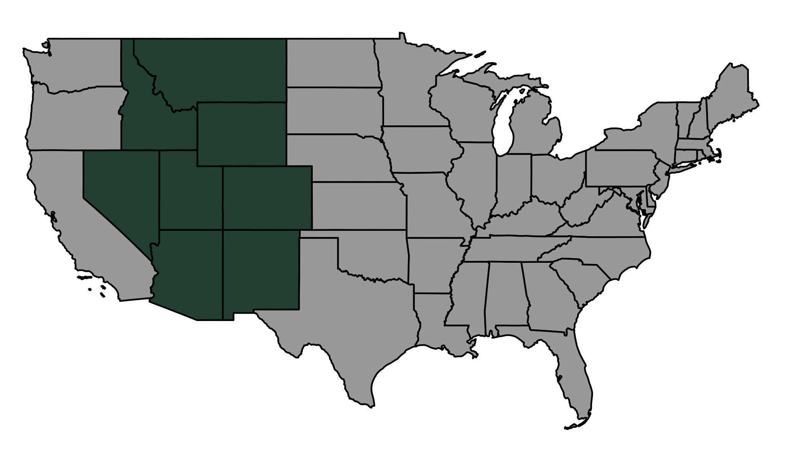
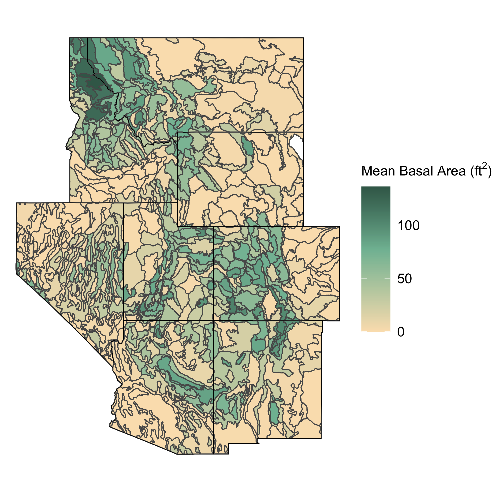
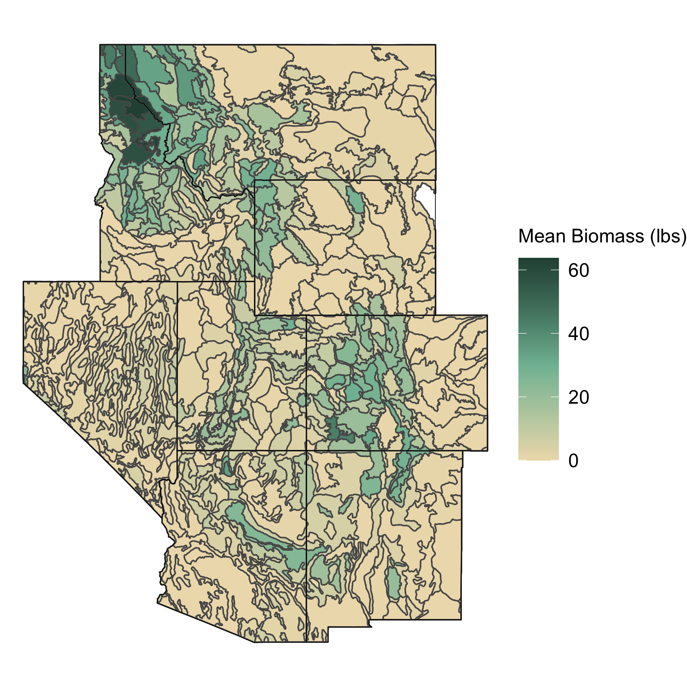
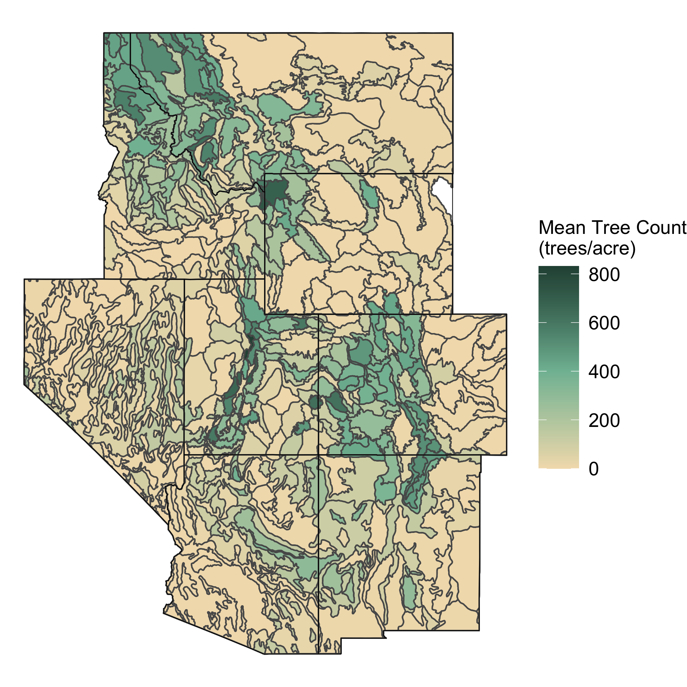
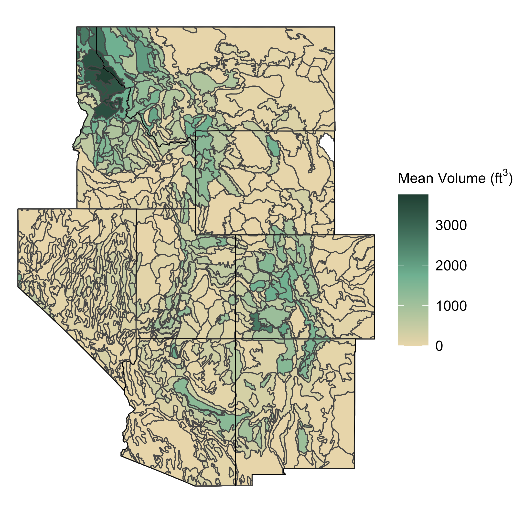
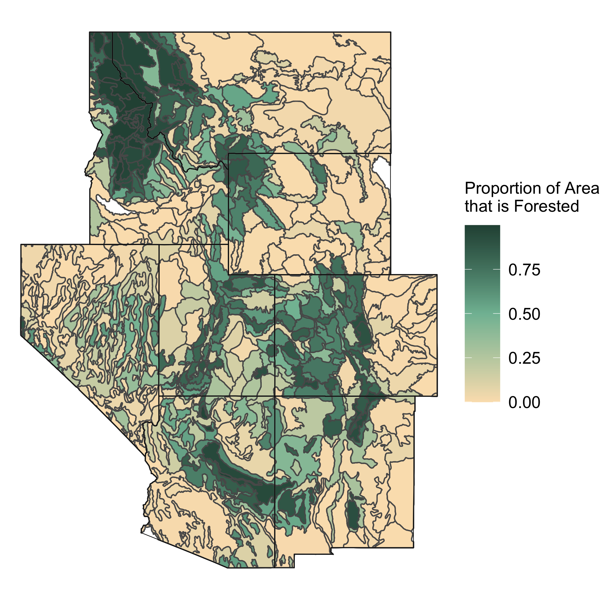
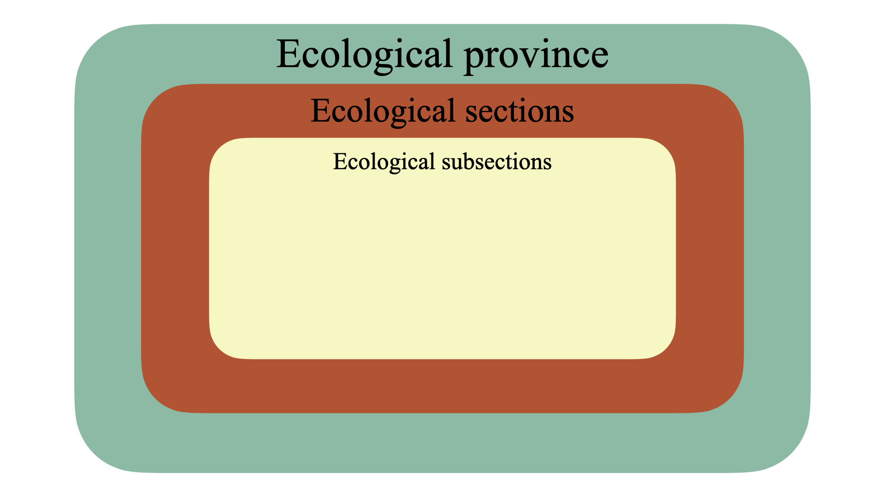

```{r data_setup, include = FALSE}
library(tidyverse)
library(sf)
library(USAboundaries)
library(patchwork)

`%ni%` <- Negate(`%in%`)

interior_west <- c("AZ", "CO", "ID", "MT", "NV", "NM", "UT", "WY")

states <- data.frame(state.abb) %>%
  filter(state.abb %ni% interior_west & state.abb %ni% c("AK", "HI")) %>%
  pull()

dat_small <- read_csv("data/subsets/dat_small.csv")
```
# Data {#data}

## The Forest Inventory & Analysis Program

The FIA has been continuously operating since 1930, and its official mission is to "make and keep current a comprehensive inventory and analysis of the present and prospective conditions of and requirements for the renewable resources of the forest and rangelands of the US." [@whatisfia]. The FIA collects data all throughout the United States by completing a survey each year of many plots of land. The areas measured by the FIA and their ground crews are approximately 30 meter by 30 meter hexagonal units. Due to the vast size of the United States and immense amount of forested land, it would be nearly impossible for the FIA to attain population data for the entire country, so it uses sampling instead. The FIA samples from the population of 30 meter by 30 meter hexagonal units by using a geographically-based systematic sampling design [@greenbook]. The FIA chooses these samples by first overlaying a hexagonal grid over the United States in which each hexagon contains approximately 6000 acres of land. It then fills these hexagons with much smaller hexagons and randomly samples from the population of small hexagons. Next, ground crews go to these sampled regions and collect variables such as basal area, trees per acre, etc. 

Along with this hand-collected data from ground crews, the FIA also uses remotely-sensed data to gain more information. For example, the `nlcd11` variable, which measures total percent tree canopy cover of a plot, is collected via remote sensing by the Multi-Resolution Land Characteristics Consortium [@nlcd11]. Throughout the duration of the thesis, I will be working to predict ground-collected data with remotely-sensed variables, such as `nlcd11`. Having remotely-sensed variables like `nlcd11` is useful to the FIA because if these variables can predict ground-collected variables well, the FIA can collect less data and have a larger effective sample size. The `nlcd11` variable is particularly useful as the data is available at a very fine (pixel-level) resolution across the entire Interior West.

## The Interior West

While the FIA collects data in all regions of the United States, the analyses in this thesis use data from the Interior West Forest Inventory and Analysis Unit (IW-FIA). Data from this unit will henceforth be referred to as data from "the Interior West". The Interior West is defined as a broad region of the United States, covering the states of Arizona, Colorado, Idaho, Montana, Nevada, New Mexico, Utah, and Wyoming. For reference I have provided the Interior West colored green on a map of the continental United States in Figure \@ref(fig:usa-map).

```{r usa-map, fig.align="center", out.width='100%', echo = FALSE, fig.cap="The Interior West region of the United States.", fig.scap="The Interior West region of the United States"}

```
<!-- The IW-FIA collects annual inventories of the Interior West, with the goal of covering 10% of the region each year, so every decade the IW-FIA should have a measurement of 100% of each Interior West state's forests. -->
The Interior West region contains the states that encompass the Rocky Mountains along with some other smaller mountain ranges. The Interior West is comprised of 855,767 square miles of extremely diverse landscapes ranging from the high mountain peaks of the Rockies to flat desert plains in Nevada and other Interior West states. Along with desert and mountains, the Interior West also includes parts of the Great Plains. Throughout this varied landscape, there is a similarly diverse range of forested areas. These areas range from regions that are very humid to areas such as the Northern Rocky Mountain Forest, which is dry and considered a temperate desert. 

## The Data: Specifics

The data used in this thesis were collected by the FIA in the span of 10 years from 2007 to 2017. While the data were collected over this 10 year period, the analyses throughout this thesis are employed under the assumption that this is a "snapshot" of the Interior West at some moment in time. Thus, no temporal features of this dataset are considered; however, the inventory year information for each plot is available. These data are plot-level (sometimes referred to as "unit-level") for the Interior West region of the United States, in which each plot consists of both ground and remotely-sensed data.

The dataframe used in this thesis is a joined dataframe derived from two FIA datasets of the Interior West: `spatial` and `response`. The `spatial` dataframe contains 89,444 observations and 70 variables, most notably the remotely-sensed explanatory variable (`nlcd11`), location information, and eco-subsection. 

The `response` dataframe contains 86,085 observations and 67 variables, most notably four response variables collected by FIA crew members (`BALIVE`, `CNTLIVE`, `BIOLIVE`, and `VOLNLIVE`), location information, and eco-subsection. The response variables noted above measure basal area, tree count, biomass, and volume, respectively. I joined these dataframes by their unique plot number and subsetted the number of variables significantly, retaining variables such as plot number, longitude and latitude, elevation, the explanatory variable, response variables, eco-subsection, eco-section, and eco-province. The resulting joined dataframe has 86,085 rows that share the same plots between the `response` and `spatial` dataframes. Table \@ref(tab:firsttab) displays a few rows of the dataframe with relevant columns selected and values rounded to the second decimal place.
\clearpage

```{r firsttab, results="asis", message = F, warning = F, echo = F}
library(knitr)
kable(dat_small %>%
        dplyr::select(BIOLIVE_TPA, BALIVE_TPA, CNTLIVE_TPA, VOLNLIVE_TPA, nlcd11, subsection) %>%
        dplyr::slice(1036:1041),
      digits = 2,
      col.names = c("BIOLIVE", "BALIVE", "CNTLIVE", "VOLNLIVE", "nlcd11", "subsection"),
      caption = "Relevant Glimpse of Data",
      caption.short = "Relevant Glimpse of Data",
      longtable = TRUE,
      booktabs = TRUE)
```

While the data cover the Interior West as a whole, the data contain very granular information, as each row represents a plot sampled by the FIA. The data also include variables that subset the Interior West into eco-provinces that contain eco-sections, and these eco-sections contain eco-subsections. In the data, on average, each eco-section contains approximately 7.06 eco-subsections, and each eco-province contains an average of 4.86 eco-sections. So, an average eco-province then contains just over 34 eco-subsections. We can take a look at the Northern Rocky Forest eco-province, colored by eco-section, with lines dividing each eco-subsection, to see this structure in action as shown in Figure \@ref(fig:northern-rocky).
\clearpage

```{r northern-rocky, echo = F, message = F, warning = F, fig.align="center", fig.cap="The Northern Rocky Forest colored by eco-section. The black lines divide the eco-subsections of the Northern Rocky Forest.", fig.scap="The Northern Rocky Forest colored by eco-section"}
subsections <- st_read("../data/SA_eco_subsection/SA_eco_subsection.shp", quiet = TRUE)
m333_sub <- subsections %>%
  filter(PROVINC == "M333")

int_west_sf <- us_boundaries(type = "state",
                         states = interior_west)

m333_sub2 <- st_intersection(int_west_sf, m333_sub)
ggplot() +
  geom_sf(data = m333_sub2,
          mapping = aes(fill = SECTION),
          color = "black") +
  scale_fill_manual(values = c("#BF4C27", "#E7AB26", "#80BCA2", "#F5F7BD")) +
  theme_void() +
  theme(
    legend.position = "bottom"
  ) +
  labs(
    fill = "Ecosection"
  )
```

The data cover a total of 14 provinces, 68 eco-sections, and 480 eco-subsections. The hierarchical structure of the data and nested nature of the eco-subsections within eco-sections within eco-provinces allows for the creation of hierarchical models that borrow strength from surrounding areas. 

While these data contain a multitude of variables, the analyses in this thesis focus on four key response variables and one explanatory variable. The response variables used are basal area ($\text{ft}^2$), trees per acre, above-ground biomass (lbs), and net volume ($\text{ft}^3$). Figures \@ref(fig:m1), \@ref(fig:m2), \@ref(fig:m3), and \@ref(fig:m4) explore the average of these variables across the Interior West region by eco-subsection in the four following maps of the Interior West. 
\clearpage

```{r m1, fig.align="center", out.width='65%', echo = FALSE, fig.scap="Mean basal area in Interior West eco-subsections", fig.cap="Mean basal area in Interior West eco-subsections."}

```
```{r m2, fig.align="center", out.width='65%', echo = FALSE, fig.scap="Mean biomass in Interior West eco-subsections", fig.cap="Mean biomass in Interior West eco-subsections."}

```
```{r m3, fig.align="center", out.width='65%', echo = FALSE, fig.scap="Mean tree count per acre in Interior West eco-subsections", fig.cap="Mean tree count per acre in Interior West eco-subsections."}

```
```{r m4, fig.align="center", out.width='65%', echo = FALSE, fig.scap="Mean net volume in Interior West eco-subsections", fig.cap="Mean net volume in Interior West eco-subsections."}

```


While there are four key variables which I will model as response variables throughout the analyses, there is also one explanatory variable which will be of much use: total tree canopy cover (coded as `nlcd11`). This variable is remotely-sensed, meaning that it was not collected by FIA ground crew members but rather with aerial photography and/or satellite imagery. I will be using this variable to predict the response variables in order to understand how accurate of estimates can be made with this remotely-sensed data (which does not require as much effort to collect). Notably, this variable is considered to contain the population totals for total canopy cover, as the data are collected for the entire Interior West region. 

Figure \@ref(fig:hists) displays the distribution of the explanatory variable `nlcd11` in the Northern Rocky Forest subset of the data compared to its distribution across the entire Interior West.
```{r hists, message = FALSE, warning=FALSE, echo = FALSE, fig.align="center", fig.retina=4, fig.height=4, fig.width=6, fig.cap="Distribution of total canopy cover in the M333 eco-province (left) and the entire Interior West (right)", fig.scap="Total canopy cover in the M333 eco-province and Interior West"}
m333 <- dat_small %>%
  filter(province == "M333")
hist1 <- ggplot(m333) +
  geom_histogram(mapping = aes(x = nlcd11, y = ..count.. / 1000), color = "black", fill = "#80BCA2", bins = 30) +
  theme_bw() +
  labs(y = "count (1000's)")
hist2 <- ggplot(dat_small) +
  geom_histogram(mapping = aes(x = nlcd11, y = ..count.. / 1000), color = "black", fill = "#80BCA2", bins = 30) +
  theme_bw() +
  labs(y = "count (1000's)")

hist1 + hist2 
```

Notably, the Northern Rocky Forest eco-province (M333) is more heavily forested than the Interior West, so the distribution of total canopy cover in this subset of the data is quite different than the the distribution across the Interior West. Apart from making these histograms, Table \@ref(tab:var-tab) summarizes the entire unit-level data and shows some summary statistics of the five key variables.
\clearpage

```{r var-tab, message = FALSE, warning=FALSE, echo = FALSE, fig.align="center", fig.retina=4}
vars <- list(dat_small$nlcd11, dat_small$BIOLIVE_TPA,
             dat_small$BALIVE_TPA, dat_small$CNTLIVE_TPA, dat_small$VOLNLIVE_TPA)
kable(dat_small %>%
  summarize(
    variable = c("nlcd11", "BIOLIVE", "BALIVE", "CNTLIVE", "VOLNLIVE"),
    mean = unlist(lapply(vars, mean, na.rm = T)),
    sd = unlist(lapply(vars, sd, na.rm = T)),
    median = unlist(lapply(vars, median, na.rm = T)),
    quantile_75 = unlist(lapply(vars, quantile, na.rm = T, probs = 0.75)),
    min = unlist(lapply(vars, min, na.rm = T)),
    max = unlist(lapply(vars, max, na.rm = T))),
   # na_count = unlist(lapply(vars, FUN = swfscMisc::na.count))),
  digits = 2,
  col.names = c("Variable", "Mean", "SD", "Median", "75th Percentile", "Min", "Max"),
  caption = "Summary Statistics of Relevant Variables",
  caption.short = "Summary Statistics of Relevant Variables",
  longtable = TRUE,
  booktabs = TRUE)
```

Table \@ref(tab:var-tab) shows how heavily skewed these key variables are, with all the variables having a median of zero. This does not prevent meaningful analyses, as the sample size of this dataset is so large ($n = 86,085$) and thus there are plenty of data to create models. 

Finally, there are also population data showing the proportion of each eco-subsection that is forested. These data allow for the creation of the post-stratified estimates which are discussed in detail in Chapter \@ref(methods). Figure \@ref(fig:strata-plot) displays the proportion of sampled areas in each eco-subsection that are forested.
```{r, message = FALSE, warning = FALSE, fig.retina = 4, fig.align = 'center', fig.height=4, fig.width=6, eval = F, include=F}
strat <- read_csv("data/population/strata.csv") %>%
  filter(fnf_no_water == 1)

subsections <- st_read("data/SA_eco_subsection/SA_eco_subsection.shp", quiet = TRUE)

subsections1 <- subsections %>%
  filter(SUBSECT %in% strat$zoneid)

int_west_sf <- us_boundaries(type = "state",
                         states = interior_west)

intersection <- st_intersection(int_west_sf, subsections1)

intersection <- left_join(intersection, strat, by = c("SUBSECT" = "zoneid"))


strat_plot <- ggplot() +
  geom_sf(data = intersection,
          mapping = aes(fill = zoneprop)) +
  geom_sf(data = us_boundaries(type = "state",
                               states = interior_west),
          color = "black",
          alpha = 0,
          size = 0.25) +
  scale_fill_gradient2(high = "#2A5043",
                       mid = "#80BCA2",
                       low = "#FBE1BB",
                       midpoint = 0.5) +
  theme_void() +
  labs(fill = TeX("Proportion of Area\nthat is Forested")) +
  theme(legend.key.size = unit(1.05, "cm"),
        legend.text = element_text(size = 14),
        legend.title = element_text(size = 14))

ggsave("figure/strata_plot.png", strat_plot)
```
```{r strata-plot, fig.align="center", out.width='65%', echo = FALSE, fig.cap="Proportion of areas that are forested in Interior West eco-subsections.", fig.scap="Proportion of areas that are forested in Interior West eco-subsections"}

```
\clearpage

## Data Structure & Hierarchy

As hinted at throughout earlier parts of this chapter, the data used in this thesis have a hierarchical structure, in which eco-subsections are nested within eco-sections which are in turn nested within eco-provinces. Every plot has each level of granularity of location data recorded, and this is what allows for the decision of how far to borrow strength from other plots to occur. Figure \@ref(fig:data-structure) is a diagram depicting the nested data structure.
```{r data-structure, fig.align="center", out.width='100%', echo = FALSE, fig.cap="The nested data structure of the Interior West. The seafoam area is the eco-province that is divided into eco-sections (red area) which is in turn divided into eco-subsections (beige area).", fig.scap="The nested data structure of the Interior West"}

```

The largest motivation for hierarchical modeling in this particular application is that observations are more similar within the hierarchies into which they are split. To understand if this is true, I perform a preliminary analysis of the data by calculating three-way ANOVAs for each key variable with predictors `province`, `section`, and `subsection`. For succinctness, we can look at the ANOVA results for one of the response variables, `BIOLIVE`, but the other variables tell a very similar story in terms of homogeneity. Table \@ref(tab:anova) displays the results of the ANOVA, and just by looking at the MSE of the ANOVA results we can see that we should expect more homogeneity within eco-subsections. 

\clearpage

```{r anova, echo=F, message=F, warning=F}
load("data/anova_BIOLIVE_TPA.rds")

knitr::kable(broom::tidy(anova_BIOLIVE_TPA),
               caption = "Analysis of Variance Model (Biomass Response)",
               longtable = TRUE,
               booktabs = TRUE)
```

The results in Table \@ref(tab:anova) allow for the conclusion that it is reasonable to believe that observations within a given eco-province are more homogeneous than observations throughout the Interior West. Thus, if eco-subsection level estimates of variables are required, it makes sense to borrow information from other eco-subsections that are within the same eco-province. This data structure and homogeneity within provinces is what drives the analyses performed henceforth in this thesis. 