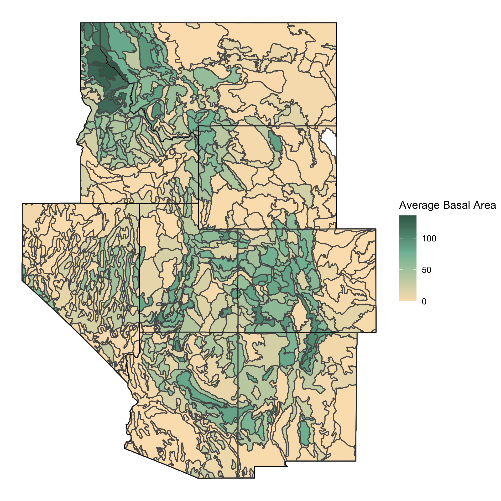
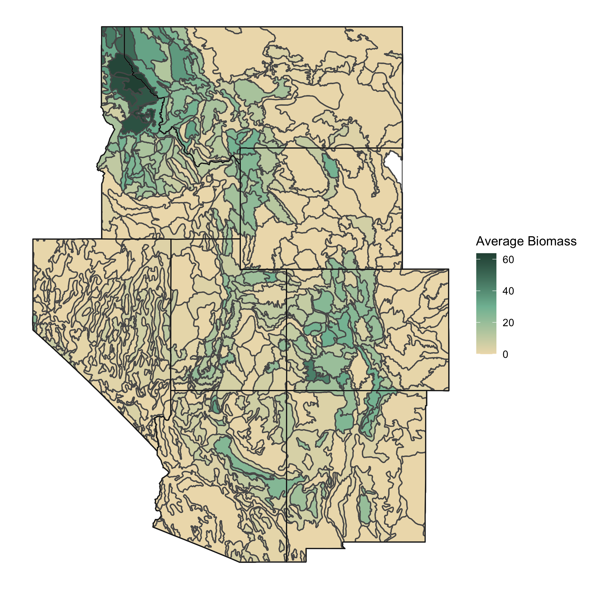
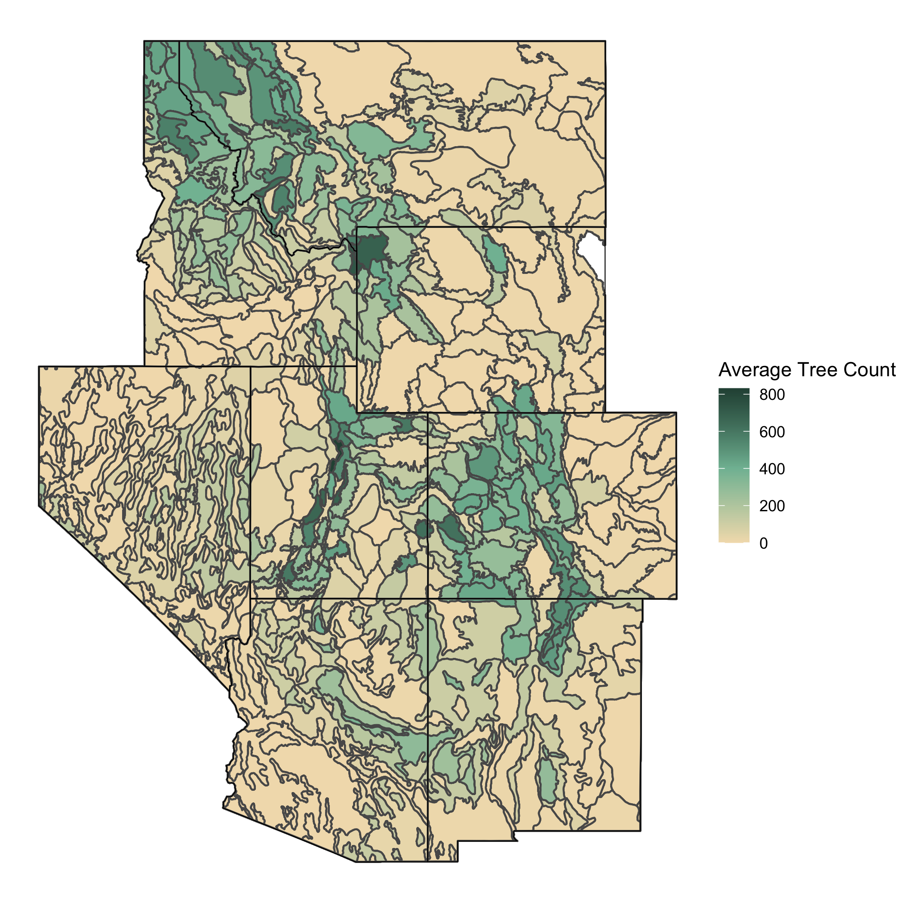
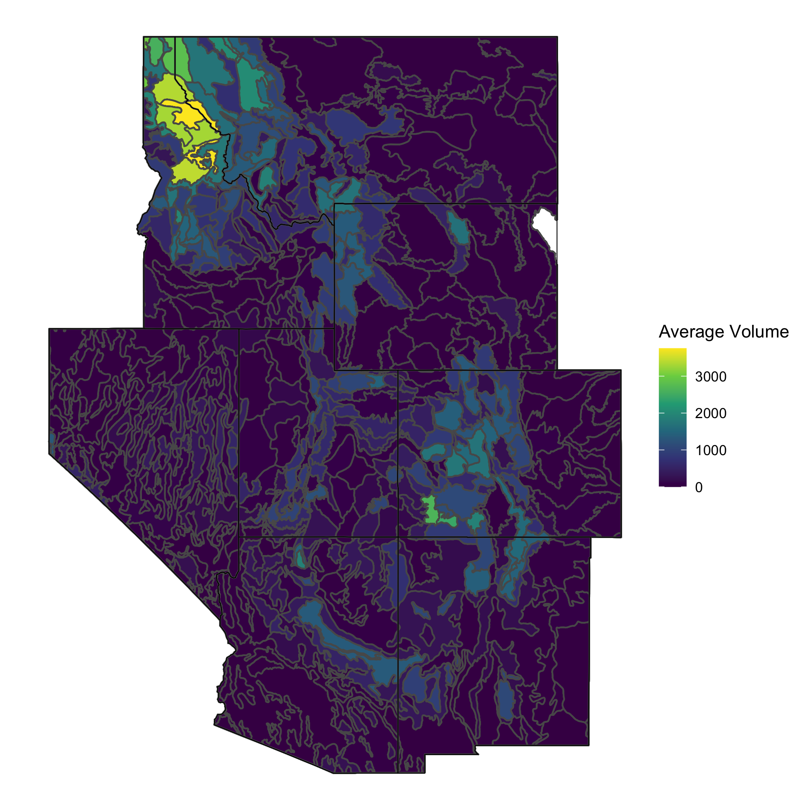

```{r data_setup, include = FALSE}
library(tidyverse)
library(sf)
library(USAboundaries)
library(patchwork)

`%ni%` <- Negate(`%in%`)

interior_west <- c("AZ", "CO", "ID", "MT", "NV", "NM", "UT", "WY")

states <- data.frame(state.abb) %>%
  filter(state.abb %ni% interior_west & state.abb %ni% c("AK", "HI")) %>%
  pull()

dat_small <- read_csv("data/subsets/dat_small.csv")
```


# Data {#data}

## The Forest Inventory & Analysis Program

The Forest Inventory & Analysis Program (FIA) is a program within the United States Forest Service which aims to collect information and data in order to assess the country's forests. The FIA has been continuously operating since 1930 and their official mission is to "make and keep current a comprehensive inventory and analysis of the present and prospective conditions of and requirements for the renewable resources of the forest and rangelands of the US." [@whatisfia]

The FIA collects data all throughout the United States by completing a survey each year of many plots of land. The units measured by the FIA and their ground crews are approximately 30 m by 30 m hexagonal units. Due to the vast size of the United States and immense amount of forested land, it would be nearly impossible for the FIA to attain population data for the country, so they use sampling instead. The FIA samples from the population of 30 m by 30 m hexagonal units by using a geographically-based systematic sampling design (Source: McConville et al, 2020). The FIA chooses these samples by first overlaying a hexagonal grid over the United States where each hexagon contains approximately 6000 acres of land. Then, they fill these hexagons with much smaller hexagons and randomly sample from the population of small hexagons. Then, ground crews go to these sampled small hexagons and collect variables such as basal area, trees per acre, etc. This plot level data is what we are working with throughout the duration of the thesis.

## The Interior West

While the FIA collects data in all regions of the United States, the analyses done in this thesis uses data from the Interior West Forest Inventory and Analysis Unit (IW-FIA). Data from this unit will henceforth be refered to as data from "the Interior West". The Interior West is defined as a broad region of the United States, covering the states of Arizona, Colorado, Idaho, Montana, Nevada, New Mexico, Utah, and Wyoming. For reference we have provided the Interior West colored green on a map of the continental United States:

```{r, fig.align="center", out.width='100%', echo = FALSE, fig.cap="The Interior West Region of the United States"}
knitr::include_graphics("figure/interior-west-on-usa.png")
```

The IW-FIA collects annual inventories of the Interior West, with the goal of covering 10% of the region each year, so every decade the IW-FIA should have measurement of 100% of each Interior West state's forests.

The Interior West region itself contains the states which encompass the Rocky Mountains along with some other smaller mountain ranges. The Interior West contains 855,767 square miles of land which has an extremely diverse landscape ranging from the high mountain peaks of the Rockies to flat desert plains in Nevada and other Interior West states. Along with desert and mountains, the Interior West also includes parts of the Great Plains. 

## Our Data: Specifics

The data used in this thesis was collected by the Forest Inventory and Analysis Program (FIA) in the span of 10 years from 2007 to 2017. While this data was collected over this 10 year period, the analyses done throughout this thesis are under the assumption that this is a "snapshot" of the Interior West at some moment in time. Thus we do not consider any temporal features of this dataset, however the inventory year information is available to us. The data we have is plot-level data for the Interior West region of the United States, where the data for each plot is collected by FIA and its crew members.

The dataframe used in this thesis is a joined dataframe derived from two FIA datasets of the Interior West, `spatial` and `response`. The `spatial` dataframe contains 89444 observations and 70 variables, most notably two remotely sensed predictor variables (`forprob` and `forbio`), location information, and ecosubsection. The `response` dataframe contains 86085 observations and 67 variables, most notably four predictor variables collected by FIA crew members (`BALIVE_TPA`, `CNTLIVE_TPA`, `BIOLIVE_TPA`, and `VOLNLIVE_TPA`), location information, and ecosubsection. We join these dataframes by their unique plot number, and subset the number of variables significantly to 19 variables which contain plot information, longitude & lattitude, elevation, predictor variables, response variables, ecosubsection, ecosection, and province. The resulting joined dataframe has 86085 rows as these are the rows which share the same plots between the `response` and `spatial` dataframes. We can see the first few rows of the dataframe with relevant columns selected:

```{r, echo = FALSE}
library(gt)
dat_small %>%
  rename(LON = LON_PUBLIC, LAT = LAT_PUBLIC, ELEV = ELEV_PUBLIC) %>%
  select(PLOT, LON, LAT, ELEV, forgrp, forprob, demLF, forbio, BALIVE_TPA) %>%
  slice(30:35) %>%
  gt()

dat_small %>%
  select(CNTLIVE_TPA, BIOLIVE_TPA, VOLNLIVE_TPA, subsection, section, province) %>%
  slice(30:35) %>%
  gt()
```

While the data covers the Interior West as a whole, we have very granular information, as each row represents a plot sampled by the FIA. The data also includes variables that subset the Interior West into provinces which contain ecosections, and these ecosections contain ecosubsections. In our data, on average, each ecosection contains approximately 7.06 ecosubsections, and each province contains an average of 4.86 ecosections. So, an average province then contains just over 34 ecosubsections. The data we have covers a total of 14 provinces, 68 ecosections, and 480 ecosubsections. The hierarchical struture of the data and nestedness of the ecosubsections within ecosections within provinces lends itself to be able to create hierarchical models which borrow strength from surrounding areas. 

While this data contains a multitude of variables, the analyses done in this thesis focus on four key response variables and two explanatory variables. The response variables used are basal area (square-foot), trees per acre, above-ground biomass (lbs), and net volume (ft^3). These variables are coded as `BALIVE_TPA`, `CNTLIVE_TPA`, `BIOLIVE_TPA`, and `VOLNLIVE_TPA`, respectively. We can look at the average of these variables across the Interior West region by ecosubsection in the four following maps of the interior west. 

```{r, fig.align="center", out.width='65%', echo = FALSE, fig.cap="Mean Basal Area in Interior West Ecosubsections"}

```
```{r, fig.align="center", out.width='65%', echo = FALSE, fig.cap="Mean Biomass in Interior West Ecosubsections"}

```
```{r, fig.align="center", out.width='65%', echo = FALSE, fig.cap="Mean Tree Count per acre in Interior West Ecosubsections"}

```
```{r, fig.align="center", out.width='65%', echo = FALSE, fig.cap="Mean Net Volume in Interior West Ecosubsections"}

```


While we have four variables which we will model as response variables throughout the analyses, we also have two predictor variables which will be of much use to us. In particular, forest probability and forest biomass (coded as `forprob` and `forbio`.) These variables which we will treat as predictors are remotely sensed variables, meaning that they were not collected by FIA crew members, but rather with aerial photography and/or satellite imagery. However, we will be using these variables to attempt to predict our response variables in order to understand how good of estimates we can make with this remote data that does not require as much effort to collect. While it may seem unnatural to attempt to predict forest biomass (`BIOLIVE_TPA`) with forest biomass (`forbio`), the differences in the data collection process between the ground level data and remotely sensed data are quite different. 

These variables are almost all right-skewed, and all take value zero quite often. To get a good sense of the distributions of the six key variables, we can look at histograms of each variable:

```{r, message = FALSE, warning=FALSE, echo = FALSE, fig.align="center", fig.retina=4, fig.height=4, fig.width=6}
hist1 <- ggplot(dat_small) +
  geom_histogram(mapping = aes(x = forprob, y = ..count.. / 1000), color = "black", fill = "steelblue") +
  theme_bw() +
  labs(y = "count (1000's)")
hist2 <- ggplot(dat_small) +
  geom_histogram(mapping = aes(x = forbio, y = ..count.. / 1000), color = "black", fill = "steelblue") +
  theme_bw() +
  labs(y = "count (1000's)")
hist3 <- ggplot(dat_small) +
  geom_histogram(mapping = aes(x = VOLNLIVE_TPA, y = ..count.. / 1000), color = "black", fill = "steelblue") +
  theme_bw() +
  labs(y = "count (1000's)")
hist4 <- ggplot(dat_small) +
  geom_histogram(mapping = aes(x = CNTLIVE_TPA, y = ..count.. / 1000), color = "black", fill = "steelblue") +
  theme_bw() +
  labs(y = "count (1000's)")
hist5 <- ggplot(dat_small) +
  geom_histogram(mapping = aes(x = BALIVE_TPA, y = ..count.. / 1000), color = "black", fill = "steelblue") +
  theme_bw() +
  labs(y = "count (1000's)")
hist6 <- ggplot(dat_small) +
  geom_histogram(mapping = aes(x = BIOLIVE_TPA, y = ..count.. / 1000), color = "black", fill = "steelblue") +
  theme_bw() +
  labs(y = "count (1000's)")
(hist1 + hist2 + hist3) / (hist4 + hist5 + hist6)
```

It is notable that the `forprob` variable is bimodal and modes zero and one, while all other variables are extremely right-skewed. This is likely because when `forprob` is decided from the remotely sensed data, there are likely areas that are either very clearly forest or very clearly not forest (residential areas, for example).

Apart from making histograms of our data, we can also summarize the data to see some summary statistics of our six key variables:

```{r, message = FALSE, warning=FALSE, echo = FALSE, fig.align="center", fig.retina=4}
vars <- list(dat_small$forbio, dat_small$forprob, dat_small$BIOLIVE_TPA,
             dat_small$BALIVE_TPA, dat_small$CNTLIVE_TPA, dat_small$VOLNLIVE_TPA)
dat_small %>%
  summarize(
    variable = c("forbio", "forprob", "BIOLIVE_TPA", "BALIVE_TPA", "CNTLIVE_TPA", "VOLNLIVE_TPA"),
    mean = unlist(lapply(vars, mean, na.rm = T)),
    quantile_25 = unlist(lapply(vars, quantile, na.rm = T, probs = 0.25)),
    median = unlist(lapply(vars, median, na.rm = T)),
    quantile_75 = unlist(lapply(vars, quantile, na.rm = T, probs = 0.75)),
    min = unlist(lapply(vars, min, na.rm = T)),
    max = unlist(lapply(vars, max, na.rm = T)),
    na_count = unlist(lapply(vars, FUN = swfscMisc::na.count))
  ) %>% 
  round(digits = 2) %>%
  gt()
```

From this table, we can see how heavily skewed these key variables are, with over 25% of the observations for each variable being zero. This does not stop us from doing meaningful analyses though, as the sample size of this dataset is so large ($n = 86085$) and thus we have plenty of data to create models with. 

## Data Structure & Hierarchy

As hinted at throughout earlier parts of the chapter, the data used in this thesis has a hierarchical structure, where ecosubsections are nested within ecosections which are in turn nested within provinces. Every plot has each level of granularity of location data recorded and this is what allows us to choose how far to borrow strength from other plots. 

The largest motivation for hierarchical modeling in this particular application is that observations are more similar within the hierarchies which we split them into. To understand if this is true, we can do a preliminary analysis on the data by performing three-way ANOVAs for each key variable with predictors `province`, `section`, and `subsection`. By just looking at the MSE of the ANOVA results, we can see that we should expect more homogeneity within ecosubsections:

```{r, echo=F, message=F, warning=F}
anova <- read_csv("data/anova.csv")
anova %>%
  select(-X1) %>%
  gt()
```
(* Need a better way to output this table and show province level model is significant)

These results allow us to conclude that it is reasonable to believe that observations within a given province are more homogeneous than observations throughout the Interior West. Thus, if we want ecosubsection level estimates of variables, it makes sense to borrow information from other ecosubsections within the same province as each other. This data structure and homogeneity within provinces is what drives the analyses done henceforth in this thesis. 

