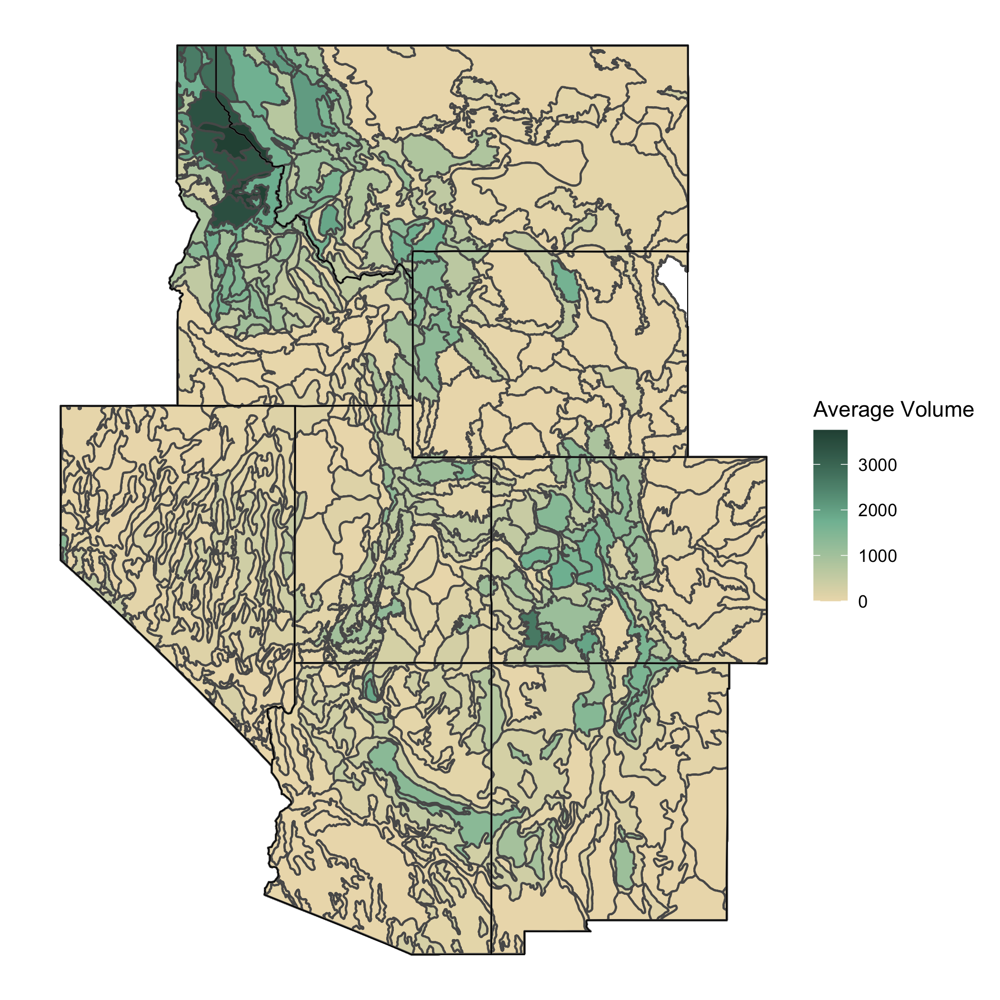

```{r data_setup, include = FALSE}
library(tidyverse)
library(sf)
library(USAboundaries)
library(patchwork)

`%ni%` <- Negate(`%in%`)

interior_west <- c("AZ", "CO", "ID", "MT", "NV", "NM", "UT", "WY")

states <- data.frame(state.abb) %>%
  filter(state.abb %ni% interior_west & state.abb %ni% c("AK", "HI")) %>%
  pull()

dat_small <- read_csv("data/subsets/dat_small.csv")
```


# Data {#data}

## The Forest Inventory & Analysis Program

The FIA is a program within the United States Forest Service which aims to collect information and data in order to assess the country's forests. The FIA has been continuously operating since 1930 and their official mission is to "make and keep current a comprehensive inventory and analysis of the present and prospective conditions of and requirements for the renewable resources of the forest and rangelands of the US" [@whatisfia].

The FIA collects data all throughout the United States by completing a survey each year of many plots of land. The units measured by the FIA and their ground crews are approximately 30 meter by 30 meter hexagonal units. Due to the vast size of the United States and immense amount of forested land, it would be nearly impossible for the FIA to attain population data for the country, so they use sampling instead. The FIA samples from the population of 30 meter by 30 meter hexagonal units by using a geographically-based systematic sampling design [@mcconville2020]. The FIA chooses these samples by first overlaying a hexagonal grid over the United States where each hexagon contains approximately 6000 acres of land. Then, they fill these hexagons with much smaller hexagons and randomly sample from the population of small hexagons. Then, ground crews go to these sampled small hexagons and collect variables such as basal area, trees per acre, etc. Along with this hand-collected data from FIA ground crews, the FIA also uses remotely sensed data to gain more information about the areas which they collect data. For example, the `nlcd11` variable, which measures total percent tree canopy cover of a plot, is collected via remote sensing by the Multi-Resolution Land Characteristics Consortium [@nlcd11]. Throughout the duration of the thesis, we will be working to predict ground-collected data with remotely sensed variables, such as `nlcd11`. Having remotely sensed variables like `nlcd11` is useful to us and the FIA because if our models can predict ground-collected variables well, the FIA can collect less data and have a larger effective sample size. 

## The Interior West

While the FIA collects data in all regions of the United States, the analyses done in this thesis uses data from the Interior West Forest Inventory and Analysis Unit (IW-FIA). Data from this unit will henceforth be referred to as data from "the Interior West". The Interior West is defined as a broad region of the United States, covering the states of Arizona, Colorado, Idaho, Montana, Nevada, New Mexico, Utah, and Wyoming. For reference we have provided the Interior West colored green on a map of the continental United States:

```{r, fig.align="center", out.width='100%', echo = FALSE, fig.cap="The Interior West region of the United States"}
knitr::include_graphics("figure/interior-west-on-usa.png")
```

The IW-FIA collects annual inventories of the Interior West, with the goal of covering 10% of the region each year, so every decade the IW-FIA should have measurement of 100% of each Interior West state's forests.

The Interior West region itself contains the states which encompass the Rocky Mountains along with some other smaller mountain ranges. The Interior West contains 855,767 square miles of land which has an extremely diverse landscape ranging from the high mountain peaks of the Rockies to flat desert plains in Nevada and other Interior West states. Along with desert and mountains, the Interior West also includes parts of the Great Plains. Throughout this diverse landscape, there is a similarly diverse range of forested areas. The forested areas range from areas that are humid and temperate to areas like the Northern Rocky Mountain Forest which is dry and considered a temperate desert. 

## Our Data: Specifics

The data used in this thesis was collected by the FIA in the span of 10 years from 2007 to 2017. While this data was collected over this 10 year period, the analyses done throughout this thesis are under the assumption that this is a "snapshot" of the Interior West at some moment in time. Thus we do not consider any temporal features of this dataset, however the inventory year information is available to us. The data we have is plot-level (sometimes referred to as "unit-level") data for the Interior West region of the United States, where the data for each plot consists of ground data collected by FIA and remotely sensed data.

The dataframe used in this thesis is a joined dataframe derived from two FIA datasets of the Interior West, `spatial` and `response`. The `spatial` dataframe contains 89444 observations and 70 variables, most notably our remotely sensed predictor variable (`nlcd11`), location information, and eco-subsection. The `nlcd11` variable was collected by the Multi-Resolution Land Characteristics Consortium [@nlcd11]. This variable measures percent tree canopy cover in a given plot. 

The `response` dataframe contains 86085 observations and 67 variables, most notably four response variables collected by FIA crew members (`BALIVE_TPA`, `CNTLIVE_TPA`, `BIOLIVE_TPA`, and `VOLNLIVE_TPA`), location information, and eco-subsection. The response variables noted above measure basal area, tree count, biomass, and volume, respectively. We join these dataframes by their unique plot number, and subset the number of variables significantly to 19 variables which contain plot information, longitude & latitude, elevation, predictor variables, response variables, eco-subsection, eco-section, and eco-province. The resulting joined dataframe has 86085 rows as these are the rows which share the same plots between the `response` and `spatial` dataframes. We can see the first few rows of the dataframe with relevant columns selected and values rounded to the second decimal place:

```{r, results="asis", message = F, warning = F, echo = F}
library(knitr)
kable(dat_small %>%
        dplyr::select(PLOT, LON_PUBLIC, LAT_PUBLIC, nlcd11, BIOLIVE_TPA, subsection) %>%
        dplyr::slice(1036:1041),
      digits = 2,
      col.names = c("Plot", "Latitude", "Longitude", "nlcd11", "BIOLIVE_TPA", "subsection"),
      caption = "Relevant Glimpse of Data",
      caption.short = "Relevant Glimpse of Data",
      longtable = TRUE,
      booktabs = TRUE)
```

While the data covers the Interior West as a whole, we have very granular information, as each row represents a plot sampled by the FIA. The data also includes variables that subset the Interior West into provinces which contain eco-sections, and these eco-sections contain eco-subsections. In our data, on average, each eco-section contains approximately 7.06 eco-subsections, and each province contains an average of 4.86 eco-sections. So, an average province then contains just over 34 eco-subsections. We can take a look at the Northern Rocky Forest province, colored by eco-section, with lines dividing each eco-subsection to see this structure in action:

```{r northern-rocky, echo = F, message = F, warning = F, fig.align="center", fig.cap="The Northern Rocky Forest colored by eco-section"}
subsections <- st_read("../data/SA_eco_subsection/SA_eco_subsection.shp", quiet = TRUE)
m333_sub <- subsections %>%
  filter(PROVINC == "M333")

int_west_sf <- us_boundaries(type = "state",
                         states = interior_west)

m333_sub2 <- st_intersection(int_west_sf, m333_sub)
ggplot() +
  geom_sf(data = m333_sub2,
          mapping = aes(fill = SECTION),
          color = "black") +
  scale_fill_manual(values = c("#BF4C27", "#E7AB26", "#80BCA2", "#F5F7BD")) +
  theme_void() +
  theme(
    legend.position = "bottom"
  ) +
  labs(
    fill = "Ecosection"
  )
```


The data we have covers a total of 14 provinces, 68 eco-sections, and 480 eco-subsections. The hierarchical structure of the data and nested nature of the eco-subsections within eco-sections within eco-provinces lends itself to be able to create hierarchical models which borrow strength from surrounding areas. 

While this data contains a multitude of variables, the analyses done in this thesis focus on four key response variables and one explanatory variable. The response variables used are basal area (square-foot), trees per acre, above-ground biomass (lbs), and net volume ($\text{ft}^3$). These variables are coded as `BALIVE_TPA`, `CNTLIVE_TPA`, `BIOLIVE_TPA`, and `VOLNLIVE_TPA`, respectively. We can look at the average of these variables across the Interior West region by eco-subsection in the four following maps of the interior west. 

```{r, fig.align="center", out.width='65%', echo = FALSE, fig.cap="Mean basal area in Interior West eco-subsections"}
knitr::include_graphics("figure/basal.png")
```
```{r, fig.align="center", out.width='65%', echo = FALSE, fig.cap="Mean biomass in Interior West eco-subsections"}

```
```{r, fig.align="center", out.width='65%', echo = FALSE, fig.cap="Mean tree count per acre in Interior West eco-subsections"}

```
```{r, fig.align="center", out.width='65%', echo = FALSE, fig.cap="Mean net volume in Interior West eco-subsections"}

```


While we have four variables which we will model as response variables throughout the analyses, we also have one predictor variables which will be of much use to us. In particular, total tree canopy cover (coded as `nlcd11`.) This variable is remotely sensed, meaning that they were not collected by FIA crew members, but rather with aerial photography and/or satellite imagery. However, we will be using these variables to attempt to predict our response variables in order to understand how good of estimates we can make with this remote data that does not require as much effort to collect. Notably, we can consider this variable to contain the population totals for total canopy cover as the data is collected for the entire Interior West region. 

To get a sense of a our predictor variable `nlcd11`, we will look at its distribution in the Northern Rocky Forest subset of our data compared to its distribution across the entire Interior West:
```{r, message = FALSE, warning=FALSE, echo = FALSE, fig.align="center", fig.retina=4, fig.height=4, fig.width=6, fig.cap="Distribution of total canopy cover in the M333 eco-province (left) and the entire Interior West (right)", fig.scap="Total canopy cover in the M333 eco-province and Interior West"}
m333 <- dat_small %>%
  filter(province == "M333")
hist1 <- ggplot(m333) +
  geom_histogram(mapping = aes(x = nlcd11, y = ..count.. / 1000), color = "black", fill = "#80BCA2", bins = 30) +
  theme_bw() +
  labs(y = "count (1000's)")
hist2 <- ggplot(dat_small) +
  geom_histogram(mapping = aes(x = nlcd11, y = ..count.. / 1000), color = "black", fill = "#80BCA2", bins = 30) +
  theme_bw() +
  labs(y = "count (1000's)")

hist1 + hist2 
```

Notably, the Northern Rocky Forest Province (M333) is much more forested than the Interior West, so we see much different distributions of total canopy cover in this subset of the data. Apart from making these histograms, we can also summarize the entire, unit-level data and see some summary statistics of our five key variables:

```{r, message = FALSE, warning=FALSE, echo = FALSE, fig.align="center", fig.retina=4}
vars <- list(dat_small$nlcd11, dat_small$BIOLIVE_TPA,
             dat_small$BALIVE_TPA, dat_small$CNTLIVE_TPA, dat_small$VOLNLIVE_TPA)
kable(dat_small %>%
  summarize(
    variable = c("nlcd11", "BIOLIVE_TPA", "BALIVE_TPA", "CNTLIVE_TPA", "VOLNLIVE_TPA"),
    mean = unlist(lapply(vars, mean, na.rm = T)),
    sd = unlist(lapply(vars, sd, na.rm = T)),
    median = unlist(lapply(vars, median, na.rm = T)),
    quantile_75 = unlist(lapply(vars, quantile, na.rm = T, probs = 0.75)),
    min = unlist(lapply(vars, min, na.rm = T)),
    max = unlist(lapply(vars, max, na.rm = T))),
   # na_count = unlist(lapply(vars, FUN = swfscMisc::na.count))),
  digits = 2,
  col.names = c("Variable", "Mean", "SD", "Median", "75th Percentile", "Min", "Max"),
  caption = "Summary Statistics of Relevant Variables",
  caption.short = "Summary Statistics of Relevant Variables",
  longtable = TRUE,
  booktabs = TRUE)
```

From this table, we can see how heavily skewed these key variables are, with all the variables having median of zero. This does not stop us from doing meaningful analyses though, as the sample size of this dataset is so large ($n = 86085$) and thus we have plenty of data to create models with. 

Finally, we also have population data showing the proportion of each eco-subsection that is forested. This data allows us to create our post-stratified estimates which are discussed in detail in the following chapter.  

## Data Structure & Hierarchy

As hinted at throughout earlier parts of the chapter, the data used in this thesis has a hierarchical structure, where eco-subsections are nested within eco-sections which are in turn nested within eco-provinces. Every plot has each level of granularity of location data recorded and this is what allows us to choose how far to borrow strength from other plots. We can see this structure of nested data by looking at a diagram depicting this data structure:
<!-- looking at an example up close of Idaho's eco-subsections colored by their province, and then their eco-sections: -->

```{r, fig.align="center", out.width='100%', echo = FALSE, fig.cap="The nested data structure of the Interior West. The green area is the eco-province which is divided into eco-sections (red area) which is in turn divided into eco-subsections (beige area).", fig.scap="The nested data structure of the Interior West"}

# idaho <- us_boundaries(type = "state",
#                          states = "ID")
# 
# id <- st_intersection(idaho, subsections)
# idsection <- ggplot() +
#   geom_sf(data = id,
#           mapping = aes(fill = SECTION)) +
#   scale_fill_viridis_d(option = "A") +
#   theme_void() +
#   theme(legend.position = "none")
# idprov <- ggplot() +
#   geom_sf(data = id,
#           mapping = aes(fill = PROVINC)) +
#   scale_fill_viridis_d(option = "A") +
#   theme_void() +
#   theme(legend.position = "none") 
# 
# idprov + idsection

```


The largest motivation for hierarchical modeling in this particular application is that observations are more similar within the hierarchies which we split them into. To understand if this is true, we can do a preliminary analysis on the data by performing three-way ANOVAs for each key variable with predictors `province`, `section`, and `subsection`. For succinctness, we can look at the ANOVA results for one of the response variables, `BIOLIVE_TPA`, but the other variables tell a very similar story in terms of homogeneity. By just looking at the MSE of the ANOVA results, we can see that we should expect more homogeneity within eco-subsections:

```{r, echo=F, message=F, warning=F}
load("data/anova_BIOLIVE_TPA.rds")

knitr::kable(broom::tidy(anova_BIOLIVE_TPA),
               caption = "Analysis of Variance Model (Biomass Response)",
               longtable = TRUE,
               booktabs = TRUE)
```

These results allow us to conclude that it is reasonable to believe that observations within a given eco-province are more homogeneous than observations throughout the Interior West. Thus, if we want eco-subsection level estimates of variables, it makes sense to borrow information from other eco-subsections within the same province as each other. This data structure and homogeneity within provinces is what drives the analyses done henceforth in this thesis. 

